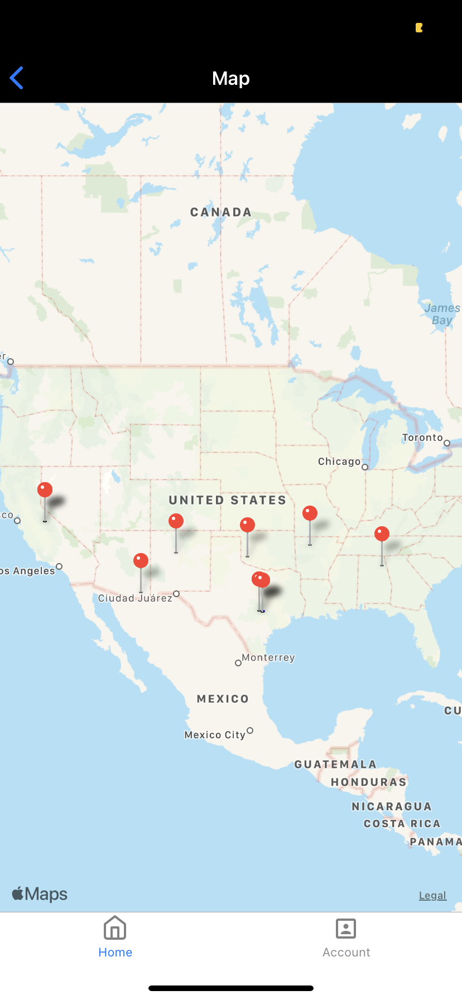
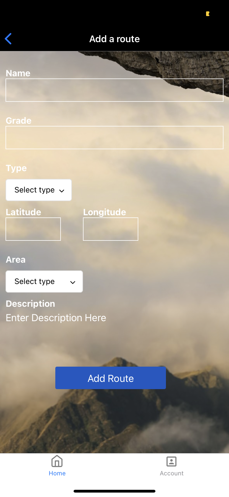
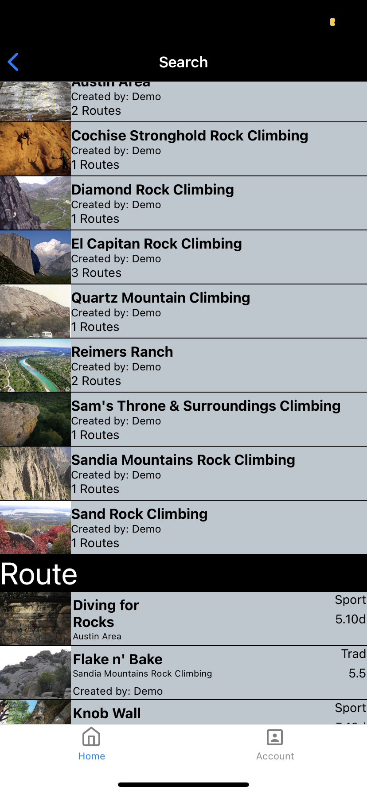

# Ascent

<p align="center">  </p>

## Introduction

Ascent is a mobile application that allows users to find information about climbing areas and routes near them as well as create new areas/routes that they might find on their climbing adventure.

## Live Link

<a href="https://appetize.io/app/yjmh15xyn699qbtz6k3d4yg61m?device=iphone11promax&scale=75&orientation=portrait&osVersion=13.3">Here</a>

## Technologies

### Backend:

| Technology   | Use                            |
| ------------ | ------------------------------ |
| PostgreSQL   | SQL database                   |
| SequelizeORM | Object Relation Mapping (ORM)  |
| Express.js   | Server framework/API endpoints |
| Node.js      | Runtime environment            |

### Frontend

| Technology   | Use                                  |
| ------------ | ------------------------------------ |
| React.js     | UI framework                         |
| React Native | Mobile Application Framework         |
| Expo         | Universal Mobile deployment platform |
| Axios        | Promised-based HTTP client           |

- BcryptJS
- Heroku

## Technical Challenges

### Setting up navigation between screens

I initially had issues setting up different navigation menus based off which screen it was coming from. I was able to successfully implement this through research by nesting the different screens as object inside each other based off where the user is on the app.

```javascript
homeFlow.navigationOptions = {
  title: "Home",
  tabBarIcon: <Feather name="home" size={24} color="grey" />,
};

const navigator = createSwitchNavigator({
  Loading: LoadingScreen,
  loginFlow: createStackNavigator({
    Landing: LandingScreen,
    Signin: SigninScreen,
    Signup: SignupScreen,
  }),
  mainFlow: createBottomTabNavigator(
    {
      homeFlow: homeFlow,
      Account: AccountScreen,
    },
    {
      tabBarOptions: {
        style: {
          backgroundColor: "white",
          height: 45,
        },
      },
    }
  ),
});
```

### Following Users/Routes/Areas

When initially setting up tables for this functionality, I created multiple join tables that allowed users to follow different things but querying was super confusing due to having to create joins. I simplified this by creating the relationship through polymorphic associations. This allowed me to reduce the number of join tables to just one, the followers table.

```javascript
//Allows user to follow areas
User.belongsToMany(models.Area, {
  as: "followedAreas",
  through: {
    model: "Follower",
    scope: {
      followable_type: "area",
    },
  },
  foreignKey: "user_id",
  constraints: false,
});

//Allows user to follow routes
User.belongsToMany(models.Route, {
  as: "followedRoutes",
  through: {
    model: "Follower",
    scope: {
      followable_type: "route",
    },
  },
  foreignKey: "user_id",
  constraints: false,
});

//Allows a user to follow another user
User.belongsToMany(models.User, {
  as: "followedUsers",
  through: {
    model: "Follower",
    scope: {
      followable_type: "user",
    },
  },
  foreignKey: "user_id",
  constraints: false,
});

//To ensure that this user can also be followed
User.belongsToMany(models.User, {
  as: "followers",
  through: {
    model: "Follower",
    scope: {
      followable_type: "user",
    },
  },
  foreignKey: "followable_id",
  constraints: false,
});
```

## Features

1. Users can sign up and log in. When they are logged in, they can search up new areas and routes near them as well as view any favorite areas and routes they have saved before.
<p align="center">  </p>

2. Users can find areas and routes near them via a map that updates based on their location. (Must allow location services)
<p align="center">  </p>

3. Users can add areas and routes they come across.

<p align="center">  </p>

4. Users can search up all areas and maps that were added to the database by themselves or other users.

<p align="center">  </p>

Other features of Ascent include:

- User Auth via JSON web tokens
- Bcrypt hashing for password security
- Upload user profile image from camera roll

## Run locally

To run locally:

1. Clone github repository
2. Navigate to client directory, install packages using npm install.
3. Run client app by typing 'expo start' in CMD line.
4. Hover of QR code with phone camera. (Must have Expo app installed on phone)
5. Open up with Expo app

## Future Features

- Follow other users
- Upload images when creating areas/routes
- Add photos to existing routes
- Comment sections
- Directions to the areas
