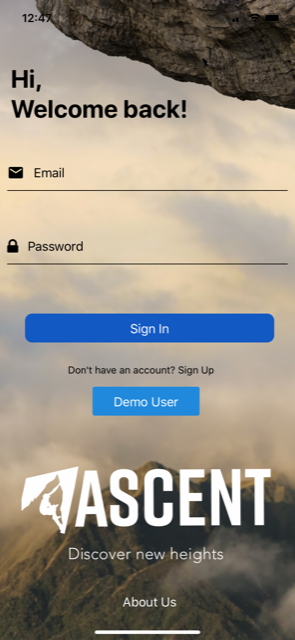
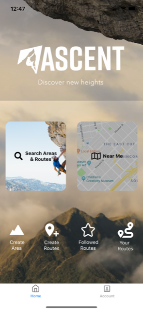
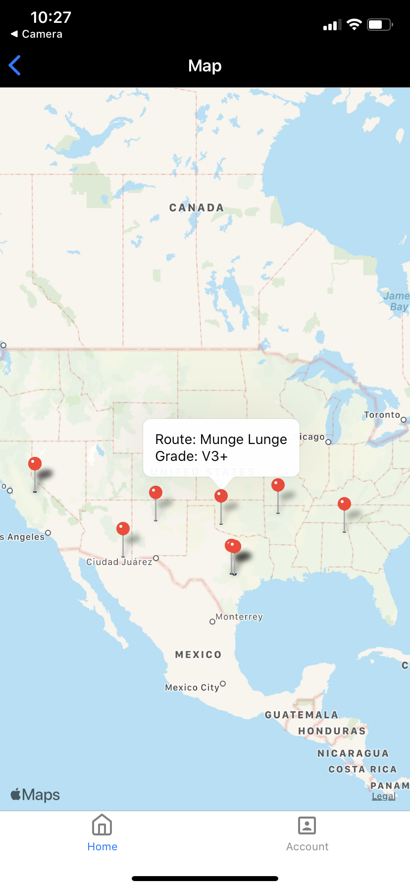
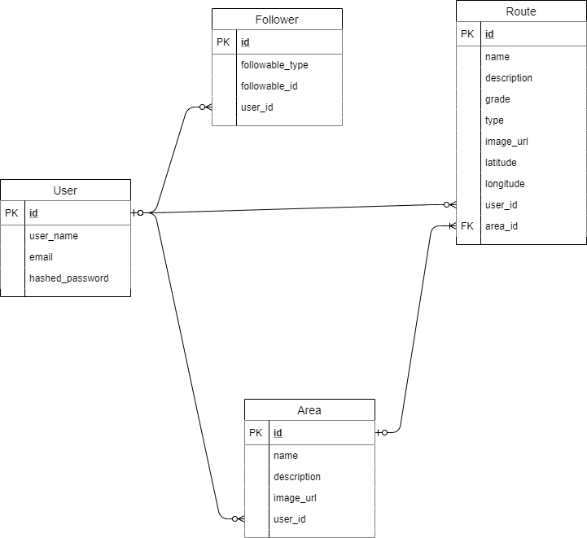

<<<<<<< HEAD
# Ascent

**Table of Contents**
  * [Introduction](#Introduction)
  * [Technologies](#Technologies)
  * [Features](#Features)
  * [Frontend](#Frontend)
  * [Backend](#Backend)
  * [Future Features](#Future-Features)

## Introduction
Ascent is a mobile application that allows users to find information about climbing areas and routes near them as well as create new areas/routes that they might find on their climbing adventure. 

## Technologies
Project is created wtih 
  * Javascript ES6
  * React-Native
  * Expo
  * ReactJS
  * Postgres
  * Node.js 
  * Express 
  * Sequelize
  * BcryptJS
  * Heroku

## Features

A few of the main features of Ascent are:

  * User Auth via JSON web tokens
  * Bcrypt hashing for password security
  * CRUD for routes, areas, and users
  * Be able to follow routes and areas through polymorphic association
  * Search functionality for areas/routes
  * Maps integration that shows nearby areas/routes
  * Upload user profile image from camera roll
  
## Frontend 

The frontend styling and functionality was created using React Native and Expo. It consists of several screen components that allow continuous navigation between each screen. 

  
  

## Backend

The backend consists of several RESTful routes that feed data from a Postgres Database using Express and Sequelize. 

## Future Features
  
  * Follow other users
  * Upload images when creating areas/routes
  * Add photos to existing routes
  * Comment sections
  * Directions to the areas 

=======
# Ascent

**Table of Contents**
  * [Introduction](#Introduction)
  * [Technologies](#Technologies)
  * [Features](#Features)
  * [Frontend](#Frontend)
  * [Backend](#Backend)
  * [Future Features](#Future-Features)

## Introduction
Ascent is a mobile application that allows users to find information about climbing areas and routes near them as well as create new areas/routes that they might find on their climbing adventure. 

## Technologies
Project is created wtih 
  * Javascript ES6

  * Expo
  * ReactJS
  * Postgres
  * Node.js 
  * Express 
  * Sequelize
  * BcryptJS
  * Heroku

## Features

A few of the main features of Ascent are:

  * User Auth via JSON web tokens
  * Bcrypt hashing for password security
  * CRUD for routes, areas, and users

  * Be able to follow routes and areas through polymorphic association
  * Search functionality for areas/routes
  * Maps integration that shows nearby areas/routes
  * Upload user profile image from camera roll
  
## Frontend 

The frontend styling and functionality was created using React Native and Expo. It consists of several screen components that allow continuous navigation between each screen. 

  

## Backend

The backend consists of several RESTful routes that feed data from a Postgres Database using Express and Sequelize. 

## Future Features
  
  * Follow other users
  * Upload images when creating areas/routes
  * Add photos to existing routes
  * Comment sections
  * Directions to the areas 

>>>>>>> cde951932b56cb9108e434a293ae435da28fea51
